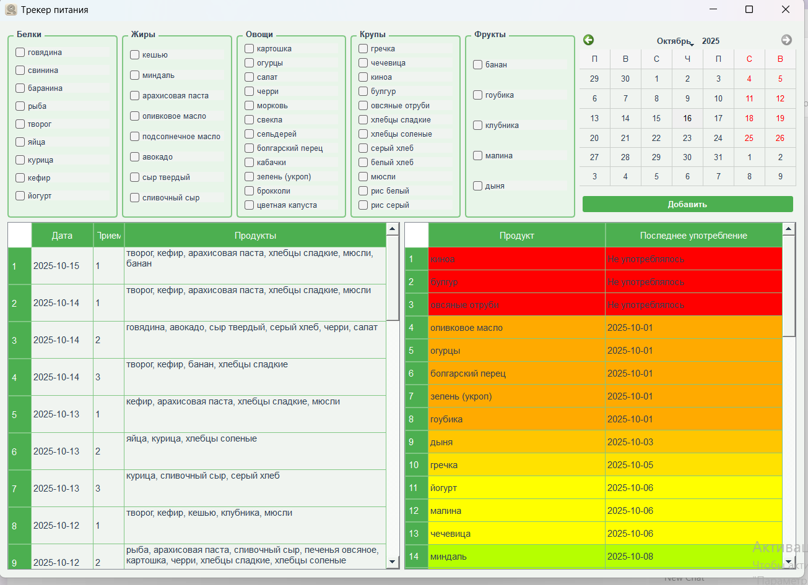

# 🥗 Трекер правильного питания

Приложение для отслеживания разнообразия рациона питания с визуальной индикацией давности употребления продуктов.



## 📋 Описание

Это приложение помогает поддерживать разнообразие в рационе, показывая какие продукты давно не употреблялись. **Приложение НЕ считает КБЖУ** - его основная задача напоминать о продуктах, которые вы давно не включали в свой рацион.

### Основные возможности:

- 📊 **Цветовая индикация**: продукты окрашиваются от зеленого (недавно употреблялось) до красного (давно не ели или никогда не отмечали)
- 🗂️ **Категоризация**: продукты разделены на категории (Белки, Жиры, Овощи, Крупы, Фрукты)
- 📅 **Календарь**: выбор даты употребления продуктов
- 📝 **История**: таблица с историей употребления продуктов по датам

## 🚀 Установка и запуск

### Требования

- Python 3.7 или выше
- PyQt5

### Установка зависимостей

```bash
pip install -r requirements.txt
```

### Запуск приложения

```bash
python main.py
```


## 💡 Как пользоваться

1. **Выберите дату** в календаре (по умолчанию - сегодня)
2. **Отметьте продукты**, которые употребили в этот день, поставив галочки
3. **Нажмите "Добавить"** - продукты будут сохранены. В день можно добавлять сколько угодно приемов.
4. **Смотрите на правую таблицу** - она показывает все продукты с градиентом:
   - 🔴 Красный - не употреблялось более 24 дней или никогда
   - 🟡 Желтый - употреблялось 8-12 дней назад
   - 🟢 Зеленый - употреблялось недавно (0-2 дня)

## 📁 Структура проекта

```
Menu/
│
├── main.py                 # Основной файл приложения
├── consumption.json        # База данных употребления продуктов
│
├── protein.txt            # Список белковых продуктов
├── fat.txt                # Список жиров
├── veget.txt              # Список овощей
├── cereals.txt            # Список круп и злаков
├── fruits.txt             # Список фруктов
│
├── icon.png               # Иконка приложения
├── fon.ico                # Иконка для Windows
│
├── requirements.txt       # Зависимости проекта
└── README.md              # Этот файл
```

## 🎨 Особенности реализации

### Цветовой градиент

Приложение использует плавный цветовой градиент для индикации давности употребления:
- Более 24 дней → RGB(255, 0, 0) - ярко-красный
- 0-2 дня → RGB(0, 255, 0) - ярко-зеленый
- Промежуточные значения - плавный переход через желтые оттенки

### Хранение данных

Данные хранятся в формате JSON, что обеспечивает:
- ✅ Читаемость (можно открыть и редактировать вручную)
- ✅ Простоту backup'а (достаточно скопировать один файл)
- ✅ Кроссплатформенность
- ✅ Легкость в обработке

Структура `consumption.json`:
```json
{
    "consumption": {
        "2025-10-15": {
            "1": ["творог", "кефир", "банан"],
            "2": ["рыба", "картошка"]
        }
    },
    "last_consumed": {
        "творог": "2025-10-15",
        "рыба": "2025-10-15"
    }
}
```

### Персонализация

Вы можете легко добавить свои продукты, отредактировав текстовые файлы:
- `protein.txt` - белковые продукты
- `fat.txt` - жиры
- `veget.txt` - овощи
- `cereals.txt` - крупы и злаки
- `fruits.txt` - фрукты

Просто добавьте название продукта на новой строке.

## 🛠️ Технологии

- **Python 3** - язык программирования
- **PyQt5** - фреймворк для GUI
- **JSON** - формат хранения данных

## 📝 Возможные улучшения

Идеи для дальнейшего развития проекта:
- [ ] Экспорт статистики в Excel/CSV
- [ ] Графики употребления продуктов по неделям/месяцам
- [ ] Импорт/экспорт списков продуктов
- [ ] Темная тема оформления
- [ ] Поиск по продуктам
- [ ] Фильтрация продуктов по категориям в правой таблице

## 📄 Лицензия

Этот проект создан для личного использования. Вы можете свободно использовать и модифицировать код для своих нужд.

## 👤 Автор

Проект создан для удобства отслеживания разнообразия рациона в рамках правильного питания.

---

**Приятного использования! 🌟**

